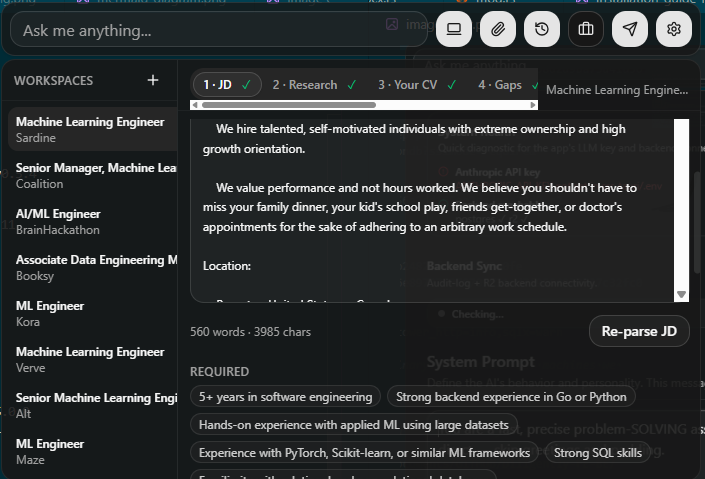
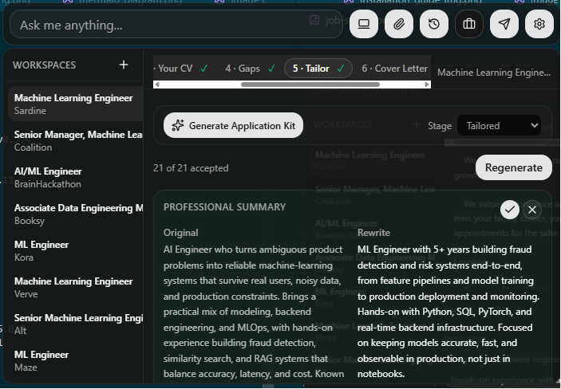
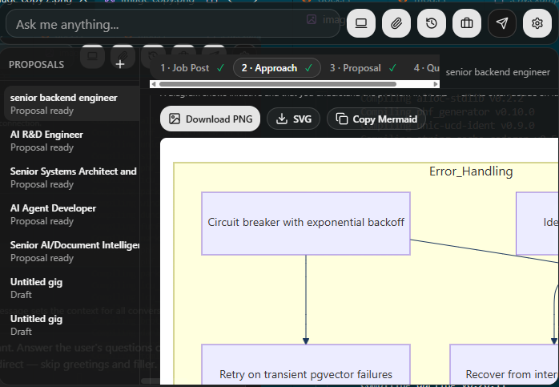
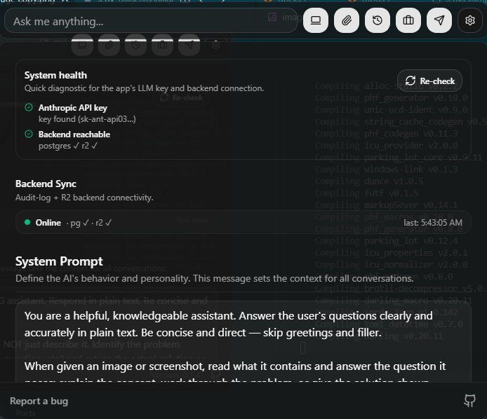
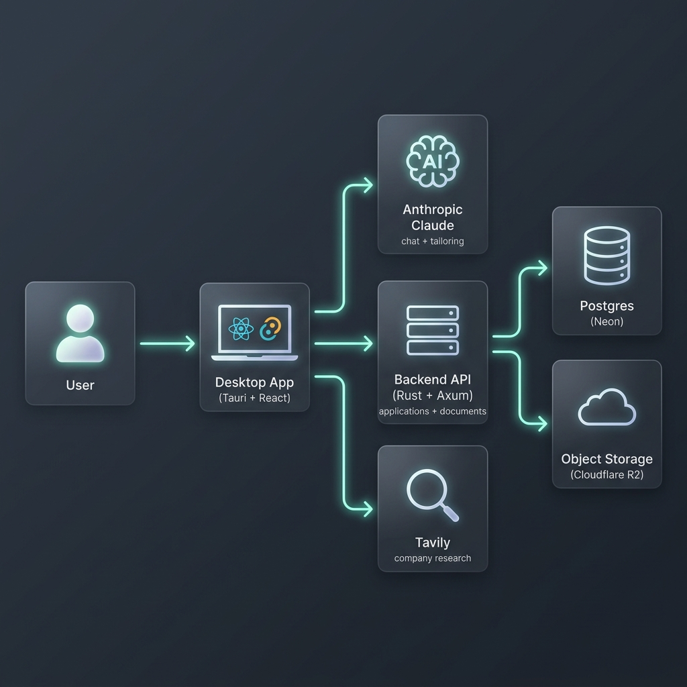
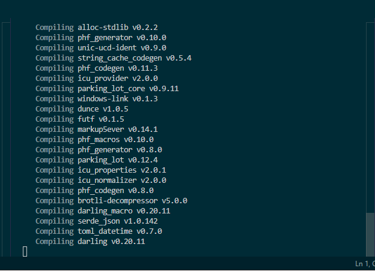
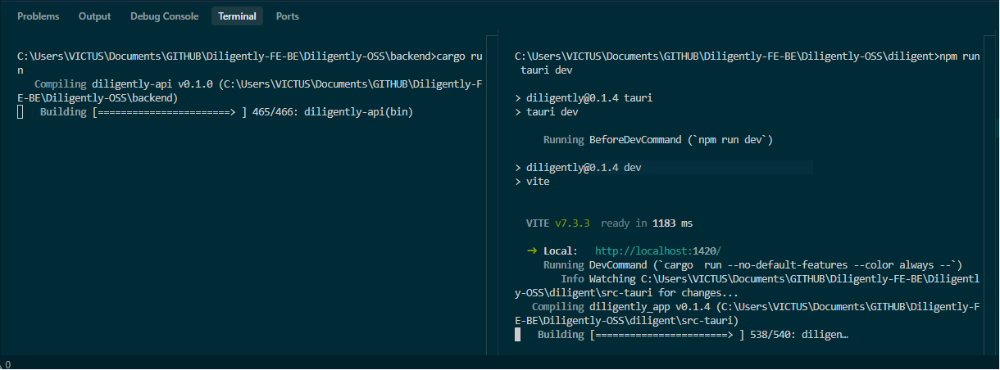

<div align="center">


# Diligently

**A desktop AI copilot for job applications.**
Research the company, tailor your CV, draft a cover letter, score it against the job description, and track everything — from a small always-on-top overlay, using your own Claude API key.

[](LICENSE)


</div>

---

## What it does

Paste a job description and Diligently walks you through a complete application:

- 🔎 **Company research** — pulls context about the company and role (via Tavily web search).
- ✂️ **CV tailoring** — rewrites your CV against the JD, with per-bullet accept/reject.
- 🧭 **Gap analysis** — shows where your experience meets (or misses) the requirements.
- ✉️ **Cover letters** — drafts a focused, role-specific letter.
- 📄 **PDF / DOCX rendering** — clean, ATS-friendly documents via a LaTeX (Tectonic) pipeline.
- 📊 **ATS scoring** — scores a tailored CV against the job description.
- 💼 **Upwork proposals** — a separate flow for freelance proposals, with architecture diagrams.
- 💬 **Quick chat** — ask a question without leaving the overlay.

Everything is **bring-your-own-key**: the desktop app talks directly to Anthropic. There is no hosted service and no telemetry.

## Screenshots

**Job Copilot** — an always-on-top overlay you can reach from anywhere. Each job lives in its own workspace and moves through a pipeline: JD → Research → Your CV → Gaps → Tailor → Cover Letter → Follow-up.



**CV tailoring** — every bullet is shown Original vs Rewrite. Accept them all, or one at a time; the accepted set renders straight to a downloadable LaTeX PDF/DOCX.



**Upwork proposals** — generates architecture (Mermaid) diagrams you can attach as supporting material for a proposal.



**Settings** — a live System Health panel (your Claude key + backend connectivity) and where you paste API keys.



## How it works

Two pieces you run locally, in two terminals — **no Docker required**:



| Component  | Path        | Stack                       | Talks to                                  |
|------------|-------------|-----------------------------|-------------------------------------------|
| Backend    | `backend/`  | Rust · Axum · SQLx          | your Postgres + your S3-compatible bucket |
| Desktop    | `diligent/` | Tauri · React · TypeScript  | the backend + Anthropic (+ Tavily)        |

The backend stores your application history and rendered documents; the desktop app is the UI. **Database migrations run automatically** the first time the backend boots — you never create tables by hand.

---

## Prerequisites

| Need | Why | Get it |
|------|-----|--------|
| [Rust](https://rustup.rs) (stable) | builds the backend + desktop shell | `rustup` |
| [Node.js 18+](https://nodejs.org) & npm | builds the desktop UI | nodejs.org |
| [Tauri OS deps](https://v2.tauri.app/start/prerequisites/) | native webview toolchain | per-OS (WebView2 on Windows) |
| A **Postgres** database | stores applications & history | **[Neon](#1-neon--postgres-database)** (free) — steps below |
| An **S3-compatible bucket** | stores rendered CVs/letters | **[Cloudflare R2](#2-cloudflare-r2--object-storage)** (free tier) — steps below |
| An **Anthropic API key** | the app's LLM | **[console.anthropic.com](#3-anthropic--claude-api-key)** — steps below |
| *(optional)* a **Tavily key** | company research | **[app.tavily.com](#4-tavily--company-research-optional)** (free) |

---

## Getting your keys

You need three services (Neon, Cloudflare R2, Anthropic) and one optional one (Tavily). Each has a free tier. Follow these once, then paste the values into the `.env` files (`scripts/setup` creates them for you).

### 1. Neon — Postgres database

1. Go to **[neon.tech](https://neon.tech)** and sign up (GitHub / Google / email). Free tier, no card.
2. Click **Create project**. Give it a name and — **important** — pick the **region closest to you**. A far region adds ~1–2s of latency to every query.
3. On the project **Dashboard**, open the **Connection string** panel and choose the **Pooled connection** (its host contains `-pooler`). It looks like:
   ```
   postgresql://<user>:<password>@ep-xxxx-pooler.<region>.aws.neon.tech/<db>?sslmode=require
   ```
4. Copy the whole string into `backend/.env` as **`DATABASE_URL`**.

> That's it — no schema setup. The backend applies its migrations automatically on first boot.

### 2. Cloudflare R2 — object storage

Rendered CVs and cover letters are stored in an S3-compatible bucket. R2 has a generous free tier (10 GB storage, **no egress fees**).

1. Sign up / log in at **[dash.cloudflare.com](https://dash.cloudflare.com)**.
2. In the left sidebar, click **R2**. The first time, Cloudflare asks you to **add a payment method** to activate R2 — the free tier still applies and you won't be charged under the limits.
3. Click **Create bucket**, name it (e.g. `diligently`), and create it.
   → put that name in `backend/.env` as **`R2_BUCKET`**.
4. Find your **Account ID** (top-right of the R2 overview, or in your dashboard URL). Your endpoint is:
   ```
   https://<ACCOUNT_ID>.r2.cloudflarestorage.com
   ```
   → put it in `backend/.env` as **`R2_ENDPOINT`**. Leave **`R2_REGION=auto`**.
5. On the R2 page, click **Manage R2 API Tokens** → **Create API Token**:
   - Permissions: **Object Read & Write** (optionally scope it to your bucket).
   - Create it, then copy the **Access Key ID** and **Secret Access Key** — they're shown **once**.
6. Put them in `backend/.env` as **`R2_ACCESS_KEY_ID`** and **`R2_SECRET_ACCESS_KEY`**.

### 3. Anthropic — Claude API key

1. Go to **[console.anthropic.com](https://console.anthropic.com)** and sign up (this is separate from a claude.ai subscription).
2. Add billing and prepay some credits (minimum **$5**).
3. **Settings → API Keys → Create Key**, and copy the `sk-ant-api03-...` value.
4. Put it in `diligent/src-tauri/.env` as **`ANTHROPIC_API_KEY`**.

### 4. Tavily — company research (optional)

1. Sign up free at **[app.tavily.com](https://app.tavily.com)** (no card).
2. Copy the API key (it starts with `tvly-`).
3. Put it in `diligent/src-tauri/.env` as **`TAVILY_API_KEY`**.

---

## Quickstart

```bash
git clone https://github.com/Talktodre-ops/diligently-jobs.git
cd diligently-jobs
```

**Run the setup script.** It copies `.env.example → .env` everywhere, generates the shared auth token, and downloads the Tectonic (LaTeX) binary into `backend/tools/`:

```bash
# Windows (PowerShell)
powershell -ExecutionPolicy Bypass -File scripts\setup.ps1

# macOS / Linux
bash scripts/setup.sh
```

**Paste your keys** (from the steps above):

- `backend/.env` → `DATABASE_URL` (Neon) and the `R2_*` values (Cloudflare R2)
- `diligent/src-tauri/.env` → `ANTHROPIC_API_KEY` (and optionally `TAVILY_API_KEY`)

**Start it — two terminals:**

```bash
# Terminal 1 — backend API (http://localhost:8787)
cd backend
cargo run

# Terminal 2 — desktop app
cd diligent
npm install
npm run tauri dev
```

The first `cargo run` compiles the backend and applies the DB migrations; the first `npm install` pulls the UI dependencies. The initial compile takes a few minutes — this is normal:



Once both are up, the backend is listening and the desktop app builds and launches:



### Verify it's working

- Backend terminal should log `migrations applied`, `r2 client ready`, and `listening`.
- Check health directly: `curl http://localhost:8787/health` → `{"status":"ok","postgres":{"ok":true},"r2":{"ok":true}}`.
- In the app, open **Settings → System health**: the **Anthropic API key** and **Backend reachable** rows should be green (see the [Settings screenshot](#screenshots) above).

---

## Configuration reference

Everything is set through two `.env` files (both gitignored — never committed).

**`backend/.env`**

| Variable | Required | What |
|----------|----------|------|
| `DATABASE_URL` | ✅ | Neon (or any) Postgres connection string |
| `R2_ENDPOINT` / `R2_BUCKET` / `R2_ACCESS_KEY_ID` / `R2_SECRET_ACCESS_KEY` | ✅ | Cloudflare R2 (or any S3-compatible storage) |
| `R2_REGION` | ✅ | `auto` for R2; the real region for AWS S3 |
| `BEARER_TOKEN` | ✅ (auto) | shared secret with the desktop app — `scripts/setup` generates it |
| `TECTONIC_BIN` | ✅ (auto) | path to the Tectonic binary — `scripts/setup` sets it |
| `BIND_ADDR` | — | defaults to `127.0.0.1:8787` |
| `RUST_LOG` | — | log filter; `sqlx=warn` for query timings |
| `LLM_API_KEY` / `LLM_API_BASE` / `LLM_MODEL` | — | optional — an OpenAI-compatible endpoint for the async ATS-scoring job |

**`diligent/src-tauri/.env`**

| Variable | Required | What |
|----------|----------|------|
| `ANTHROPIC_API_KEY` | ✅ | your Claude key (`sk-ant-...`) |
| `ANTHROPIC_MODEL` | — | defaults to `claude-sonnet-4-6` |
| `TAVILY_API_KEY` | — | optional — enables the company-research step |

**`diligent/.env`** holds `VITE_BACKEND_URL` (defaults to `http://localhost:8787`) and `VITE_BEARER_TOKEN` (the shared token, set by `scripts/setup`).

> Rotating a key? The desktop reads `src-tauri/.env` at startup — restart the app after changing it.

---

## Troubleshooting

<details>
<summary><strong>System health shows "ANTHROPIC_API_KEY not set"</strong></summary>

The desktop reads it from `diligent/src-tauri/.env` (not the backend one). Make sure the key is there and **restart the app** — it's read once at startup.
</details>

<details>
<summary><strong>Backend logs lots of "slow statement" warnings</strong></summary>

That's just your Postgres answering in 1–2s (normal for a remote DB). The default `RUST_LOG=...sqlx=error` hides them; pick a Neon **region close to you** to make queries faster. Set `sqlx=warn` if you want the timings back.
</details>

<details>
<summary><strong>CV/PDF rendering fails ("spawn tectonic ...")</strong></summary>

`scripts/setup` downloads Tectonic into `backend/tools/`. If the download was blocked, install it yourself (<https://tectonic-typesetting.github.io/>) and either drop the binary in `backend/tools/` or set `TECTONIC_BIN` in `backend/.env`.
</details>

<details>
<summary><strong>Ctrl+C in the desktop terminal asks "Terminate batch job (Y/N)?"</strong></summary>

That prompt is cmd.exe's own behavior for `npm run` scripts on Windows — the app itself exits cleanly. To stop without the prompt, just **close the app window (X)**.
</details>

---

## Project structure

```
diligently-jobs/
├── backend/            Rust + Axum API (applications, CV/cover-letter render, ATS)
│   ├── migrations/     SQL migrations (auto-applied on boot)
│   ├── src/            routes, jobs worker, R2 + Postgres, LaTeX/DOCX render
│   └── .env.example
├── diligent/           Tauri + React desktop app
│   ├── src/            React UI (Job Copilot, Upwork, chat, settings)
│   ├── src-tauri/      Rust shell (window, shortcuts, screenshot, Tavily)
│   └── .env.example
├── images/             README screenshots + diagrams
├── scripts/            setup.ps1 / setup.sh
└── README.md
```

## Contributing

Issues and PRs are welcome — [open an issue](https://github.com/Talktodre-ops/diligently-jobs/issues/new). Please run `cargo check` (in `backend/` and `diligent/src-tauri/`) and `npm run build` (in `diligent/`) before opening a PR.

## Acknowledgments

Built and maintained by **ANDERSON Victor** ([@Talktodre-ops](https://github.com/Talktodre-ops)).

The desktop shell began as a fork of [Pluely](https://github.com/iamsrikanthnani/pluely) (MIT, © 2025 Srikanth Nani); the upstream license is retained in [`diligent/third-party-notices/pluely-mit.txt`](diligent/third-party-notices/pluely-mit.txt). See [`diligent/NOTICE`](diligent/NOTICE) for details.

## License

[MIT](LICENSE) © 2026 ANDERSON Victor.
